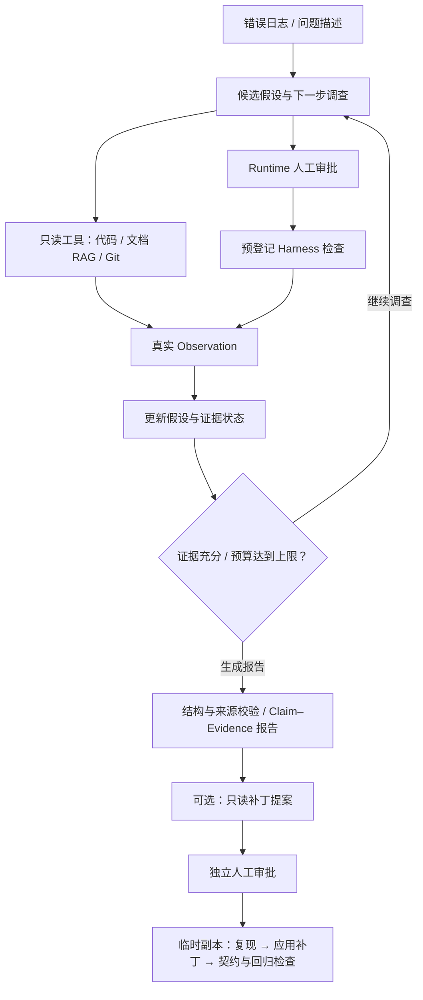

# IncidentPilot · V14

**证据驱动的 Python 故障诊断 Agent**

从错误日志出发，结合代码、业务文档、Git 历史与经审批的运行结果，定位异常背后的系统根因，输出可追溯的诊断报告和修复建议；支持只读补丁提案与临时副本验证。

当前交付版本：**V14.10**。提供 CLI 演示和 Markdown 报告，适合展示 Agent 调查决策、证据约束、受控执行与评测设计。

**技术栈：** Python · LangGraph · Pydantic · SQLite · 本地 RAG · OpenAI-compatible API

[使用与实现指南](GUIDE.md) · [演示入口](GUIDE.md#15-运行产品化演示) · [评测复现](GUIDE.md#11-工具消融runtime-evidence成本与稳定性实验) · [版本记录](CHANGELOG.md)

## 解决什么问题

异常堆栈通常只能指出“在哪里报错”，并不直接说明“为什么允许错误发生”。

以仓库中的 `missing_user_id` 为例：Service 在 `payload["user_id"]` 处抛出 `KeyError`，但仅把下标访问改为 `.get()` 并不能满足接口契约。Agent 需要进一步核对 API 调用链和业务文档，识别 **API 未校验必填字段、非法输入被传入 Service** 这一上游根因，并给出“返回 400、阻断下游调用”的修复建议。

业务示例：[API 入口](demo_app/app/api.py) · [Service 抛错点](demo_app/app/service.py) · [接口契约](demo_app/docs/api.md)。这些文件保留故障行为，用于复现与评测。

## 核心设计

### 1. 假设驱动的调查决策

模型提出候选根因，根据新证据更新支持状态、反证和下一步工具动作。LangGraph 管理循环、条件分支、预算和终止条件：

- 新取证结果需要先归入假设；没有新证据时限制重复更新，减少调查空转。
- 定向读取与已读区间去重减少重复检索，压缩上下文时保留目标窗口中的关键代码。
- confirmed 假设取得足够独立来源后可以早停；预算末尾在额度允许时补充一次证据归类，再生成报告。

### 2. 可追溯的证据链

`Observation → Evidence → Claim` 把实际工具结果、报告引用和诊断结论连接起来。

- **结构校验：** Pydantic 验证报告字段、类型和引用关系。
- **来源验证：** 引用必须对应成功的真实 Observation，文件、行号、Git 提交或 Runtime ID 必须匹配允许来源。
- **语义质量：** 根因完整性和修复可执行性由评测辅助检查；来源真实不等于结论一定正确。

### 3. 受控执行、恢复与补丁验证

- Runtime 默认关闭，执行同时受配置、Profile、预登记 Harness、预算和人工审批限制；模型不能提供任意 Shell 命令。
- SQLite Checkpoint 支持审批后跨进程恢复；幂等账本复用已完成执行结果，结果不确定时拒绝自动重跑。
- 历史事故 Memory 经人工批准后才进入召回池，并只作为线索，必须在当前调查重新取证。
- 补丁绑定已取证文件和诊断 Claim，经独立审批后在临时副本验证修复前后行为，正式工作区不变。

## 调查流程

状态与审批可持久化；日常演示默认使用静态调查，执行能力按需启用。

## 实验结果与口径

### 固定条件下的历史优化对照

V13 与 V14.3 使用同一组 **5 个 development 案例、每例一次**；模型均为 `deepseek-v4-flash`，固定 `full` Profile 和调查预算，温度使用服务商默认值。

| 指标 | V13 | V14.3 |
|---|---:|---:|
| 通过案例数 | 1/5 | 3/5 |
| 平均根因关键词覆盖率 | 40.00% | 93.33% |
| 平均模型调用次数 | 9.8 | 8.6（约下降 12%） |
| 平均 Token 消耗 | 57,336.6 | 52,684.2（约下降 8%） |

这是小样本单次观测，尚不能证明稳定的泛化提升。平均工具调用由 13.6 增至 14.0，总耗时由 262.84 秒增至 321.25 秒，因此不宣称整体提速；各优化的贡献也未通过独立消融完全分离。

证据：[V13 基线汇总](demo_app/evals/results/v13-v14.1-development.json) · [V14.3 对照汇总](demo_app/evals/results/v14.3-development.json)。

### 最终 V14.9 严格评测

最终评分要求明确异常类型，并引用全部必需代码文件；其口径比历史对照更严格，不与前表直接计算提升幅度。

| 分组 | 通过 / 运行 |
|---|---:|
| Development | 5/5 |
| Hidden | 4/7 |
| Runtime 专项 | 1/1 |
| 合计 | **10/13** |

正式运行中来源校验违规为 0；三个确定性失败保留原判。LLM Judge 完成 13/13 份报告评价，语义通过 12/13，作为辅助指标，不改变确定性评分。

**数据集关系：** 12 个核心故障场景对应 development 5 + hidden 7；另有 2 个复用已有故障的 challenge 变体和 1 个 Runtime 专项，共 15 个评测定义。正式 13 例包含上述 12 个核心场景和 Runtime 专项，不包含 2 个 challenge；development 与历史五案例对照是同一集合，不是额外独立测试集。

Judge 与 Agent 使用同一模型，每例仅运行一次，因此存在同模型自评偏差。关键词覆盖、引用有效和语义评分各自衡量不同层面，均不能单独证明生产环境可靠性。

证据：[数据集分组](demo_app/evals/_benchmark_manifest.json) · [最终评测汇总、失败原因与来源哈希](demo_app/evals/results/v14.9-formal-evaluation.json)。

### 验证与复现

V14.10 交付时，**216 项离线测试通过**，覆盖控制流、来源校验、工具权限、审批恢复、补丁验证和演示导出。

另有 Benchmark 确定性审计检查分组、故障复现、Harness、文档检索、答案隔离与结果哈希；审计检查记录与单元测试不是同一种计数，不累加作为测试总数。

仓库提交了评测汇总、运行配置、提交 ID 及原始报告 SHA-256。完整原始模型交互报告保存在本地忽略目录 `.incident_reports/`，**未随仓库发布**；公开汇总可供核对，但不等于包含完整原始轨迹。

安装、配置、演示、离线测试与付费评测命令统一见 [GUIDE.md](GUIDE.md)。真实调查和 Judge 会消耗模型 API Token；离线测试及自检不调用真实模型。

## 阅读代码

| 关注点 | 入口 |
|---|---|
| 调查状态、路由、预算与早停 | [graph.py](graph.py)、[hypotheses.py](hypotheses.py) |
| 工具注册、Schema 与上下文压缩 | [registry.py](registry.py)、[context_manager.py](context_manager.py) |
| Observation、报告模型与来源验证 | [models.py](models.py)、[provenance.py](provenance.py) |
| 本地文档检索 | [retrieval.py](retrieval.py)、[knowledge_tools.py](knowledge_tools.py) |
| Checkpoint、审批恢复与 Memory | [session_agent.py](session_agent.py)、[session_store.py](session_store.py)、[memory.py](memory.py) |
| Harness 与隔离补丁验证 | [harness.py](harness.py)、[patch_verification.py](patch_verification.py) |
| 确定性评测与语义 Judge | [evaluation.py](evaluation.py)、[llm_judge.py](llm_judge.py) |
| 产品演示与报告导出 | [main.py](main.py)、[demo_cli.py](demo_cli.py) |

## 适用范围与边界

- 项目是面向本地 Python 故障场景的单机 Agent 原型，尚未提供多用户服务或生产部署能力。
- RAG 使用本地词法特征、稳定哈希向量与余弦检索，没有接入外部 Embedding 或向量数据库。
- 多来源与早停采用工程启发式；模型置信度未经概率校准，也不能据此保证自然语言推断正确。
- 临时副本只隔离工作区修改，不提供容器或操作系统级网络、文件系统隔离；Harness 只应登记可信检查。
- 子进程与 SQLite 不构成原子事务，幂等账本不承诺所有外部副作用 exactly-once。
- 工具读取到的代码和文档会进入配置的模型服务；密钥、测试答案、运行状态和评测原始报告不应进入 Agent 取证范围。

详细用法与约束见 [使用与实现指南](GUIDE.md)，版本演进见 [CHANGELOG.md](CHANGELOG.md)。
